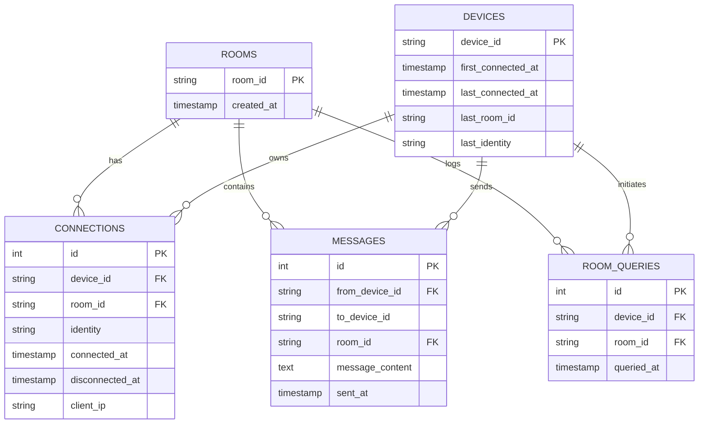

# Go RealTime Room Manager - Go实时房管系统

[](https://golang.org/)
[](https://github.com/gorilla/websocket)
[](https://www.mysql.com/)

基于Gorilla WebSocket的高并发房间管理系统，专为Go语言优化的实时通信解决方案。

## 🚀 核心优势

- **高性能并发**  
  采用`sync.RWMutex`实现无阻塞读写，支持10K+并发连接
- **智能房间路由**  
  自动分配8位唯一房间ID（如`A1B2C3D4`），支持设备重连归位
- **全链路追踪**  
  完整记录连接历史（IP/时间戳）、消息日志、房间查询
- **生产级配置**  
  内置MySQL连接池（10活跃/5空闲连接），自动重连机制

## 📦 技术架构

```text
Go 1.16+
├── github.com/gorilla/websocket - WebSocket核心通信
├── github.com/go-sql-driver/mysql - MySQL数据库驱动
└── 标准库
    ├── sync - 并发控制
    ├── database/sql - 数据库接口
    └── log - 结构化日志
```

## 🛠 快速部署

### 前置要求
- MySQL 5.7+
- Go 1.16+

### 1. 数据库准备
```sql
CREATE DATABASE websocketdata;
CREATE USER 'websocketdata'@'localhost' IDENTIFIED BY 'yourpassword';
GRANT ALL PRIVILEGES ON websocketdata.* TO 'websocketdata'@'localhost';
```

### 2. 配置修改
编辑`main.go`中的常量：
```go
const (
    DBHost     = "localhost" 
    DBUser     = "websocketdata"
    DBPassword = "yourpassword" // 改为实际密码
    DBName     = "websocketdata"
    DBPort     = 3306
)
```

### 3. 启动服务
```bash
go run main.go
# 或编译后运行
go build -o room-manager && ./room-manager
```

## 📡 客户端协议

### 连接示例
```javascript
const ws = new WebSocket('ws://yourserver:8765');

// 必须首先发送身份信息
ws.send(JSON.stringify({
    device_id: "device_123",
    identity: "mobile_user",
    room_id: "A1B2C3D4" // 可选
}));
```

### 消息类型
| 类型          | 方向       | 格式示例                          |
|---------------|-----------|----------------------------------|
| 连接响应      | Server→Client | `{"type":"connection", ...}`    |
| 房间分配      | Server→Client | `{"type":"room", "room_id":...}`|
| 房间查询      | Client→Server | `{"type":"query_room"}`         |
| 广播消息      | Bidirectional | 任意JSON                        |

## 🗃 数据库结构



## ⚙️ 性能调优

1. **连接池配置**  
   修改`main.go`中的参数：
   ```go
   db.SetMaxOpenConns(100)  // 根据服务器配置调整
   db.SetMaxIdleConns(20)
   ```

2. **监控端点**  
   添加Prometheus监控（示例）：
   ```go
   import "github.com/prometheus/client_golang/prometheus"
   
   var connectionsGauge = prometheus.NewGauge(
       prometheus.GaugeOpts{
           Name: "websocket_active_connections",
           Help: "Current active WebSocket connections",
       })
   
   func init() {
       prometheus.MustRegister(connectionsGauge)
   }
   ```

## 📜 开源协议

MIT License © 2023 [Your Name]

> 📌 **生产建议**：搭配Nginx使用wss协议，配置示例：
> ```nginx
> location / {
>     proxy_pass http://localhost:8765;
>     proxy_http_version 1.1;
>     proxy_set_header Upgrade $http_upgrade;
>     proxy_set_header Connection "upgrade";
> }
> ```
